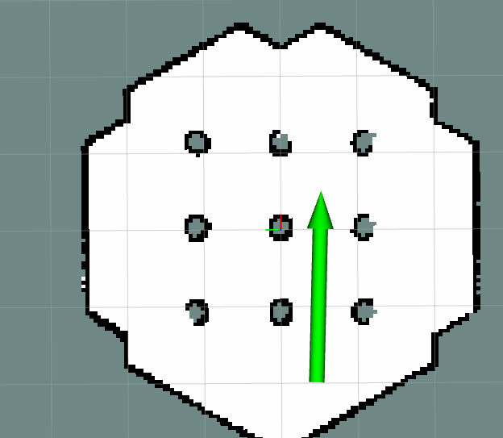
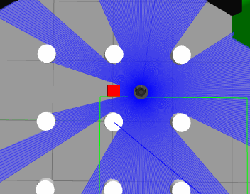

# turtlebot3_humble_ws
* 取り組み課題１
### コンテナビルド
* VScodeを使用し、「開発コンテナを開く」でコンテナをビルドしてください。
### gazebo起動
* 以下のコマンドで起動してください。

`ros2 launch turtlebot3_gazebo turtlebot3_world.launch.py`

(注)起動してもタートルボットが出現しない場合はもう一度起動し直してください。
(注)今回はburgerを使用する。
### Navigation2の起動
* 新しいターミナルで以下のコマンドを実行してください。

`ros2 launch turtlebot3_navigation2 navigation2.launch.py use_sim_time:=True map_yaml_file:=/opt/ros/humble/share/turtlebot3_navigation2/map/turtlebot3_world.yaml rviz:=True`

* rvizの画面から`2D Pose Estimate`をクリックし、gazebo画面上のタートルボットと同じ位置から矢印を伸ばす。矢印の向きはタートルボットと同じ向きとする。向きはマウスをドラッグすることで操作できます。

### タートルボットの目的地指定
* 新しいターミナルで以下のコマンドを実行

`source install/setup.bash`

`ros2 run my_continuous_nav send_goal `

キーボードから目的地のX座標、Y座標、最終的なタートルボットの向きを入力してください。

### タートルボットの繰り返し運動
* 新しいターミナルで以下のコマンドを実行
+ タートルボットが(x,y,θ)(0.5,0.5,0)→(-0.5,0.5,90°)→(0.5,-0.5,-90°)→(-0.5,-0.5,180°)の順に繰り返し移動します。

`source install/setup.bash`

`ros2 run my_continuous_nav continuous_navigator `

### 障害物の追加
* 新しいターミナルで以下のコマンドを実行

`source install/setup.bash`

`ros2 run my_continuous_nav spawn_obstacle `

* 成功すれば、以下のように赤い障害物がgazeboに出現します。

### 障害物の削除

`ros2 service call /delete_entity gazebo_msgs/srv/DeleteEntity "{name: '障害物の名前'}"`

* 障害物の名前は`custom_obs_x座標_y座標`です。(例(x,y)=(0.5,0.0)のとき、`custom_obs_0_5_0_0`)

### タートルボットの現在位置の取得
* 新しいターミナルで以下のコマンドを実行

`source install/setup.bash`

`ros2 run my_continuous_nav pose_subscriber`
## プログラムの構成や背景
* `src/my_continuos_nav/my_continuos_nav`以下に作成したプログラムを置きました。
* ``タートルボットの各種パラメータは`src/turtlebot3/turtlebot3_navigation2/param/humble/burger.yaml`に記載されています。

* このプログラムはシミュレータ上のワールド上をburgerのモデルが障害物を避けながら、指定された位置まで移動するものです。

### 工夫した点・アピールポイント
* シミュレータ上でタートルボットを任意の点に移動できるようにしました。
* 障害物を後から追加できるようにしました。
* タートルボットの位置と向きを取得し、デバックしやすくしました。
* コンテナ内で実行できるようにすることで、いつでも同じ環境で実行できるようにしました。

## AIツールの使用範囲
以下の作成にgoogle geminiを使用しました。
* Dockerfile
* .devcontainer.json
* `my_continuous_nav/my_continuous_nav`以下のPythonプログラム